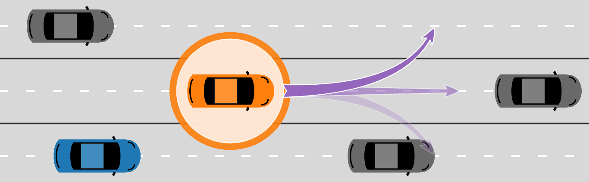

# Vehicle Behavior Prediction and Generalization Using Imbalanced Learning Techniques

> _Imb-intention-prediction_ is a library containing the implementation for the paper: 
> **Vehicle Behavior Prediction and Generalization Using Imbalanced Learning Techniques**.
> The paper has been accepted for the _24th IEEE International Conference on Intelligent Transportation Systems_ - ITSC2021 and can be accessed [here](https://arxiv.org/abs/2109.10656).
> All code is written in Python 3 using a combination of [PyTorch](https://pytorch.org/) and [scikit-learn](https://scikit-learn.org/stable/).
> Most functionality for training and evaluation is contained within .ipynb files. We recommended using Jupyter Lab as is indicated in the requirements file.
> Should you have any questions about the paper or the implementations found in this repository you are welcome to contact me at [_theodor.westny [at] liu.se_](https://liu.se/en/employee/thewe60).



##### If you found the content of this repository useful, please consider citing the paper in your work:
```
@inproceedings{westny2021vehicle,
  title={Vehicle Behavior Prediction and Generalization Using Imbalanced Learning Techniques},
  author={Westny, Theodor and Frisk, Erik and Olofsson, Bj{\"o}rn},
  booktitle={IEEE 24th International Conference on Intelligent Transportation Systems (ITSC)},
  pages={2003--2010},
  year={2021}}
```
***

#### Hardware requirements
The original implementation make use of a considerable amount of data (several gigabytes worth) for training and testing which can be demanding for some setups. For you reference all code has been tried and used on a computer with the following specs:
```
* Processor: Intel® Xeon(R) E-2144G CPU @ 3.60GHz x 8
* Memory: 32 GB
* GPU: NVIDIA Corporation TU102 [GeForce RTX 2080 Ti Rev. A]
```

## Installation

It is recommended to perform installation within a [virtual environment](https://docs.python.org/3/library/venv.html)
```bash
python3 -m venv imb-intention-prediction/
```

Make sure to activate the environment before installing any packages.

```bash
source imb-intention-prediction/bin/activate
```

Once activated, use the package manager [pip](https://pip.pypa.io/en/stable/) to install the proposed libraries.


```bash
pip install -r requirements.txt
```

Create the necessary file structure for processed data and storage of trained models.

```bash
python3 setup_filestructure.py
```

## Data extraction 

Unzip NGSIM data sets contained within the provided .zip file, a simple python script has been provided for your convenience..

```bash
python3 unzip_data.py
```

After following the given steps above, you may proceed with data extraction. Please note that the extraction process is by no means optimized and may take several hours to complete depending on your current setup.

```bash
python3 data_extraction.py
```


Once the data has been extracted, files should be organized provided by the functionality in *organize_data.py* script.

```bash
python3 organize_data.py
```

This operation has been seperated from the extraction process in case you need to modify the amount of lane-keeping data you would like to use during training and testing. This part is highlighted within the script.


## Usage

Start by firing up a jupyter session:

```bash
jupyter-lab
```

The main file for your consideration is [train_network.ipynb](train_network.ipynb).
The notebook incorporates all necessary imports and may easily be run by commenting out the latter cells to train any given network, either by your own implementation or using any of the networks investigated in the paper that can be found in [mdl-implementation](mdl-implementation)

How to re-create the model proposed in the paper is presented at the end of the *train_network.ipynb*. The classifier in the combined model may either be a dense network or a SVM (as proposed in the paper), both of which are implemented.

Stored models can be be used for inference, and how to combine an AE with its respective classifier, can be done using the methods implemented in [CombinedAECF.ipynb](mdl_implementation/CombinedAECF.ipynb).
Combining several model into one ensemble may be done using [VotingEnsemble.ipynb](mdl_implementation/VotingEnsemble.ipynb)

## Data sets
For model training and evaluation, publicly available data sets provided by the Federal Highway Administration (FHWA) are used. The data sets contain recorded highway traffic data captured at 10 Hz from US-101 and Interstate 80.
The original data can be downloaded [here](https://data.transportation.gov/Automobiles/Next-Generation-Simulation-NGSIM-Vehicle-Trajector/8ect-6jqj), provided under the following [license](https://creativecommons.org/licenses/by-sa/4.0/).

For the purpose of the paper, some modifications have been made on the original data, provided in a .zip file contained in the repository for your own use. Redistributing the modified data is done under the original license.
For details on the modifications, see the accompanying notes on the data sets.

## License
[Creative Commons](https://creativecommons.org/licenses/by-sa/4.0/)
